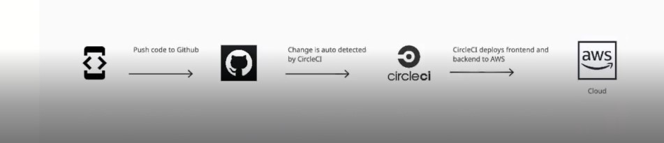

# links
### frontend link
http://udagram-frontend1.s3-website-us-east-1.amazonaws.com/home

### api server link
http://udagram-api-env.eba-2ibrmqp7.us-east-1.elasticbeanstalk.com/

### link for circle ci
[](https://dl.circleci.com/status-badge/redirect/gh/Bassam-T/udagram/tree/main)

# Dependencies

```
- Node v14.15.1 (LTS) or more recent. While older versions can work it is advisable to keep node to latest LTS version

- npm 6.14.8 (LTS) or more recent, Yarn can work but was not tested for this project

- AWS CLI v2, v1 can work but was not tested for this project

- A RDS database running Postgres.

- A S3 bucket for hosting uploaded pictures.

```

# Infrastructure description

```
Data exchanged between our AWS Cloud and the Client Apllication 

1. Client Apllication send(Render[HTML]) to AWS CLoud
2. AWS CLoud send user input

inside the AWS Cloud, data exchanged between (RDS Postgres,elastic beanstalk and the front end) as explained in the diagram

```

# Pipeline process

```
pipline process has 3 steps

1. pushing the source code to github
2. change detected automaticly by circle ci
3. circle ci deploys frontend and backend to AWS

the diagram below show the process
```
<br>

